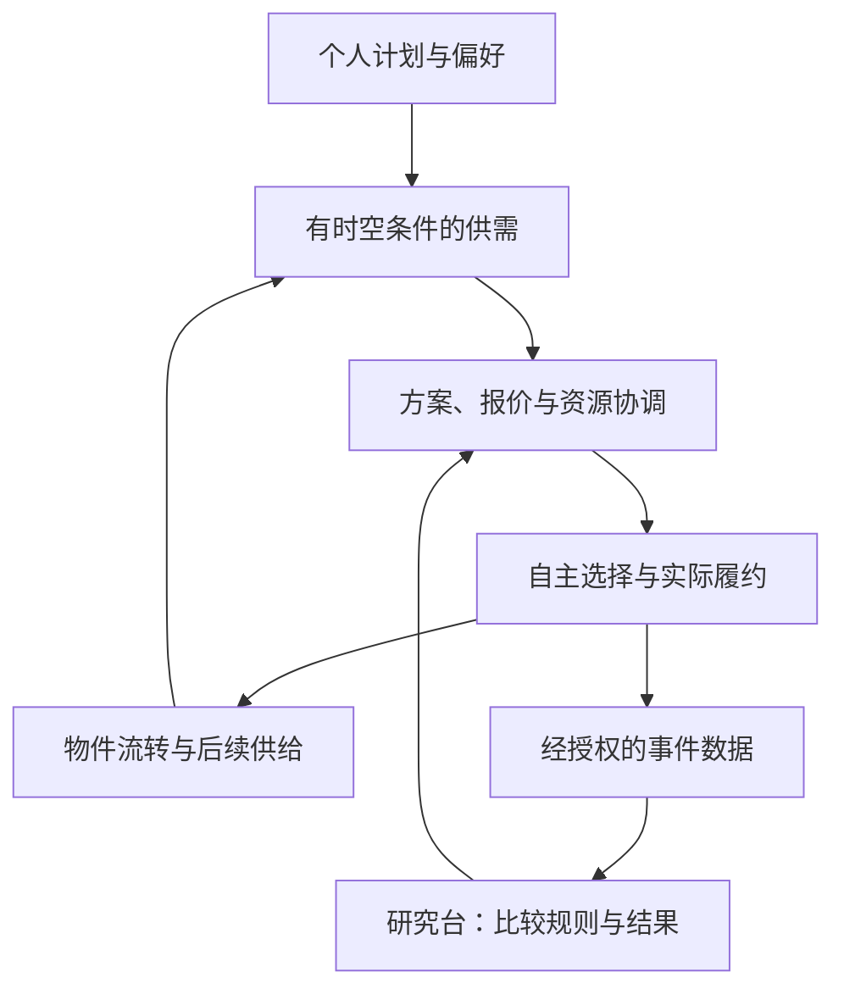

# 栖流 FlowHome
### 生活可以安顿，人可以流动。
**居住有期限，生活不必将就。**

FlowHome 探索一种共享与分布式的 home：当人因为工作、学习或个人选择迁居时，物件、服务和附近的连接能够被接续，让离开的人轻装出发，让到来的人更容易安顿。

我们从一次具体的**生活交接**开始，把个人的居住计划、物件选择和退出安排，连接成可协调的城市供需网络；再通过研究台，检验不同规则如何影响生活成本、服务可达性、物件流转和组织经营。

[打开城市生活实验室](https://flowhome-city-lab.vbill.chatgpt.site) · [浏览全部文档](docs/README.md) · [研究台设计](docs/research-workbench.md) · [原始执行与验收基线](docs/execution-acceptance-v1.md)

> **项目状态｜源码同步中**  
> 已同步应用源码、README、文档导航、模拟生成器与当前 120 次实验报告。标准城市规模表保留原设计目标，不等于当前实测规模。历史报告和品牌图片正在单独传输。当前实现、运行命令和证据见 [实现说明](IMPLEMENTATION.md)；真实用户数据为 0。

## 从一个人的生活，看见一座城市的市场

小栖准备在一座城市住一年，希望用上合适的净水设备。她关心的不只是买入价格，还包括安装、维护、离开时怎么办，以及整段居住期间实际花了多少钱。

FlowHome 的方案是：先表达居住期限、预算和偏好，再比较购买与服务安排；如果运营方能够承担资金和履约风险，可以提出有明确条件的退出承诺。小栖离开后，设备经检测、整备，再交到下一位有需要的人手中。

当更多人表达“何时到来、需要什么、何时可能离开”，零散的选择就形成了带有时间、地点和条件的供需。推荐还会反过来影响人们买什么、未来释放什么，因此系统必须检验：今天看起来合算的方案，会不会造成明天的库存、运力拥堵或承诺风险？

**这里的市场，包括供给、需求、报价、选择与履约；供需登记和推荐本身不等于成交。**

## 我们所说的 home

| 组成 | FlowHome 的关注 |
| --- | --- |
| 空间 | 阶段性的生活落脚点，以及人在其中如何安顿 |
| 物件与家具 | 获取、使用、维护和离开后的去向 |
| 附近的关系 | 与接手者、服务者及社区建立可选择的连接 |
| 习惯与记忆 | 生活经验可以分享，私人记忆由本人决定是否保留或传递 |

“分布式”首先指家的支持分布在人、物和服务网络中，不预设区块链或去中心化技术架构。首个可验证切口是物件与服务的生活交接；房屋转租、关系接续和跨城市网络属于后续探索。

## 产品的两面

| 面向 | 核心问题 | 主要内容 |
| --- | --- | --- |
| 个人端 | 我怎样在有限的居住时间里过好生活？ | 居住计划、方案比较、承诺条件、使用与退出、交接记录 |
| 城市与运营端 | 这些选择能否被可靠承接？ | 供需时间窗、物件轨迹、服务容量、资金与承诺台账 |
| 研究台 | 哪些数据与规则真正改善了这个系统？ | 数据版本、模拟 case、算法配置、对照实验、城市流动与群体结果 |

## 研究台不是一组装饰性图表

研究台应首先回答“正在看哪份数据”，然后才解释“用了什么算法、运行了什么实验、观察到了什么”。

- **数据版本**：模拟/真实来源、实体数量、生成规则、时间范围、种子、已知缺口。
- **模拟数据**：在“重置演示”附近提供“使用模拟数据”与 case 下拉框，覆盖正常交接和失败情景。
- **算法引擎**：硬条件筛选、有限信息预测、方案比较、容量与现金约束、事件更新；修改参数后实际重算。
- **城市流动**：分开呈现人口迁居、物件流转和服务任务，区分预测、已确认安排及已完成事件。
- **实验与反馈**：相同外部条件下比较策略，保留不利结果；未来经授权的真实数据用于校准假设，更新必须重新验证。

## 标准模拟城市：验收目标

| 项目 | 既有执行基线 |
| --- | --- |
| 地理范围 | 3 个上海片区，位置为示意 |
| 居民 / 初始物件 | 1,000 名模拟居民 / 600 件物件 |
| 商品型号 / 服务商 | 30 个 / 8 个 |
| 时间范围 | 104 周 |
| 核心品类 | 净水设备、办公椅、床垫 |
| 策略对照 | B0 自由购买与事后出售；B1 提前登记与匹配；B2 预测协调 |
| 压力情景 | 集中离城、需求下降、服务容量下降 |

上述表格是原始验收目标。已同步实现采用另一套明确标注的配置：默认 1,331 条需求、260 件初始物品、104 周及 A/B/C/D 四组策略，详见 [当前实现](IMPLEMENTATION.md)。两者不可混用，也没有预测全面胜出的结论。

## 从这里继续读

| 想了解什么 | 文档 |
| --- | --- |
| 产品为什么存在，如何从个体行动形成市场 | [产品与生活交接](docs/product.md) |
| 研究台页面结构、调参和数据反馈闭环 | [研究台](docs/research-workbench.md) |
| 数据版本、实体字典、case 与来源标签 | [数据与模拟场景](docs/data-and-scenarios.md) |
| 算法如何计算、哪里不能越界 | [算法引擎](docs/algorithm-engine.md) |
| 如何读懂城市里的流动 | [城市流动可视化](docs/city-flow-visualization.md) |
| 怎样比较策略，什么结果才可信 | [实验与指标](docs/experiments.md) |
| 8 分钟如何讲清项目 | [演示脚本](docs/demo-guide.md) |
| 哪些已确认、哪些未验证、下一步做什么 | [状态与路线图](docs/status-and-roadmap.md) |

## 如何参与

欢迎围绕一个具体场景提出问题：谁在什么时间需要什么，当前安排为什么无法满足，改变规则后谁受益、谁承担成本？研究与开发贡献应附输入、假设、事件过程及失败分支。产品、服务和组织规则都可以讨论。

文档可直接在 GitHub 阅读。源码运行方式、模块路径与已保存的验证证据见 [实现与运行说明](IMPLEMENTATION.md)。产品与研究设计文档保留源码同步前的状态说明；其待建设规格不能直接视作已实现能力。
