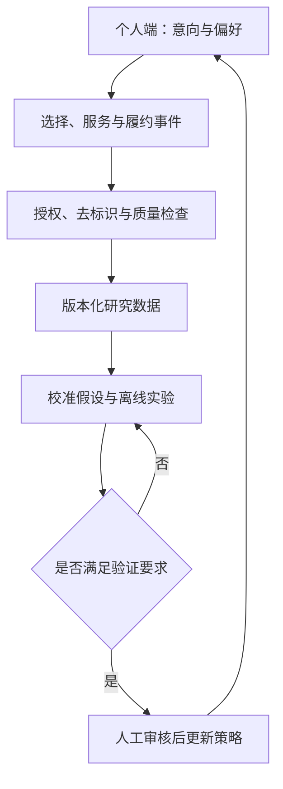

# 研究台：数据、引擎与计算机模拟实验

[文档导航](README.md) · [数据与场景](data-and-scenarios.md) · [算法引擎](algorithm-engine.md) · [城市流动](city-flow-visualization.md)

> 本文是研究台的设计规格。已有演示的存在不等于以下功能全部通过验收；实现与数据状态见[状态页](status-and-roadmap.md)。

## 定位

研究台供研究者与开发者优化支持市场系统的底层规则：如何在有限信息下匹配供需、协调服务、提出可承担的承诺，并观察不同人群的生活结果。

个人端让人表达真实需求；研究台检验这些表达如何变成推荐与履约。真实数据未来可以改善参数估计，但不会自动证明算法有效，更不意味着自动把所有交互用于训练。

## 页面顺序

| 区域 | 必须回答的问题 | 展示和操作 |
| --- | --- | --- |
| 1. 当前数据 | 我在看哪个版本？到底有多少 mock 数据？ | 来源标签、版本、实际实体数量、时间范围、生成器与种子、缺失说明 |
| 2. 当前引擎 | 用了什么规则？依据哪些信息？ | 引擎版本、策略、可见信息边界、参数与硬约束 |
| 3. 模拟实验 | 此次改变什么，与谁比较？ | case、基线、实验配置、运行进度、结果与导出 |
| 4. 城市流动 | 谁、什么东西、什么服务在何时流动？ | 时间轴、分层地图、供需与容量、明细联动 |
| 5. 结果与解释 | 谁受益、谁未被满足、成本落在哪里？ | 总体和群体指标、账目、未匹配原因、失败分支 |

## 数据状态栏

不写笼统的“城市实时大数据”。应从实际加载的清单生成类似文案：

> 当前数据：模拟数据 · {dataset_id} / {dataset_version}  
> {实际居民数} 名居民、{实际物件数} 件物件、{实际需求数} 条需求、{实际事件数} 条事件；时间范围 {start–end}。  
> 生成器 {generator_version}，种子 {seed}。人物与价格为模拟；地理为示意。

这里的花括号是待实现的绑定字段。没有数据时显示“尚未加载数据”，不能把 1,000 人的标准目标写成当前事实。数据版本、引擎版本、网站发布版本分别显示，不能互相替代。

## “使用模拟数据”与重置

在“重置演示”附近加入“使用模拟数据”入口和 case 下拉框，选项详见[场景目录](data-and-scenarios.md)。

- 选择 case 先展示简短摘要：改变了哪些条件、关注哪些指标、是否为压力情景。
- 点击加载，在独立模拟会话中读取固定初始快照和配置，生成新的运行标识。
- case 切换后，个人计划、城市图、运营账目与研究结果统一绑定到新运行，避免混用。
- “重置当前 case”恢复该 case 的初始状态及默认参数；“恢复参数”只还原编辑区；“重新运行”提交参数并产生新运行。
- 用户修改了参数但尚未运行时，显示“参数已修改，结果尚未更新”。旧结果可以保留作比较，但必须标注其运行标识。
- 没有真实数据接入时，仅展示模拟入口；未来接入真实数据后，切换模拟不得覆盖真实记录。

## 引擎与调参

参数分为环境假设、策略偏好和可用资源三组。居住期限与二手接受度属于个人输入；需求强度、采纳率与取消率属于模拟假设；运力和资金属于资源；目标权重属于策略。

输入校验应区分整数数量、0–1 概率、非负金额和时间窗。非法值阻止运行，并解释原因。权重变化不能放松物件适配性或已确认承诺等硬约束。

点击运行后冻结输入快照，结果仅在计算成功后发布。每次运行保存数据版本、引擎版本、case、参数、种子、时间范围和代码版本。运行失败时展示失败原因，不回退成看似成功的预置数字。

## 实验面板

研究台同时支持：

1. **单个 case 的因果过程检查**：观察取消、容量下降等事件如何传导到排程、库存与账目。
2. **同外部条件的策略比较**：B0、B1、B2 使用同一组外部事件，保留策略引起的内生差异。
3. **多种子稳健性检查**：标准及压力情景运行 10 个固定评估种子，观察均值、范围及失败比例。
4. **敏感性检查**：改变采纳率或预测误差，辨别结论是否依赖乐观假设。

单次动画回放不能替代多次实验。比较参数不同的两次运行时，应列出差异，不把差异全归因于算法策略。

## 数据如何回到系统

优先记录推荐曝光、接受/拒绝、意向变更、确认承诺、交付、维护、取消、实际付款等不同事件。用户可以自愿提供拒绝原因；“没有选择”不能直接推断为价格过高。

真实数据可能存在只覆盖平台用户、只有成功交易留下完整记录等偏差。每版数据记录来源、覆盖范围和缺失情况，真实字段与合成补全分开标记。不要把调参用的数据再次当作独立评估数据。

## 核心验收

- 首屏能够识别当前数据类型、版本和真实计数。
- 切换 case 或重算后，所有视图的运行标识一致。
- 修改相关条件能够改变计算结果，或说明为何未变。
- 能从一项指标追溯到事件与分母，从一项推荐追溯到输入与约束。
- 明确显示未满足需求、失败运行、期末库存和承诺敞口。
- 真实数据接入与策略上线均作为后续独立能力验收。
